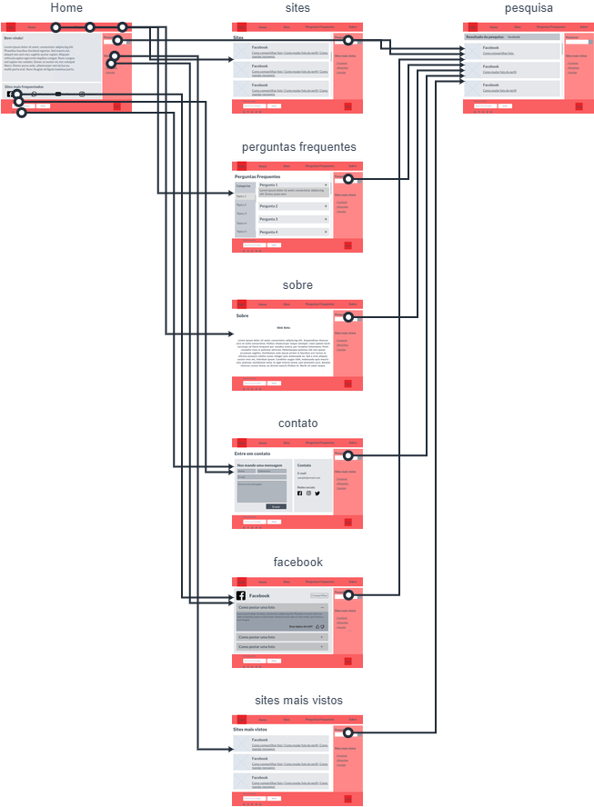
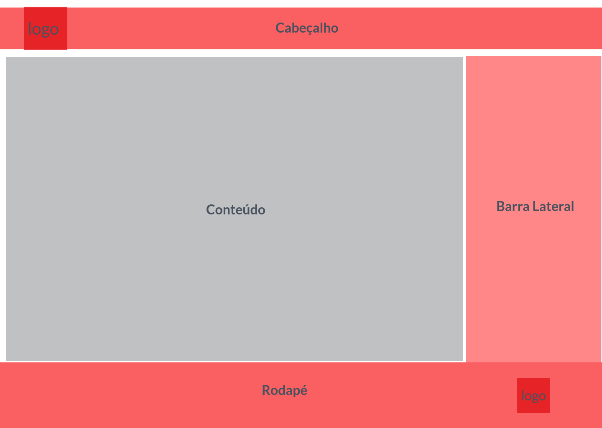

# Projeto de Interface

Para a interface do nosso sistema, buscamos fazer algo prático e ágil. Assim, todas as telas possuem o mesmo padrão e foram projetadas para funcionarem em aplicações web.

## User Flow

O diagrama apresentado mostra o fluxo de interação do usuário pelas telas do sistema. Cada uma dessas telas é detalhada na seção de Wireframes abaixo. Para a visualização do wireframe interativo

## Wireframes

> São protótipos usados em design de interface para sugerir a
> estrutura de um site web e seu relacionamentos entre suas
> páginas. Um wireframe web é uma ilustração semelhante do
> layout de elementos fundamentais na interface.
> 
> **Links Úteis**:
> - [Ferramentas de Wireframes](https://rockcontent.com/blog/wireframes/)
> - [MarvelApp](https://marvelapp.com/developers/documentation/tutorials/)
