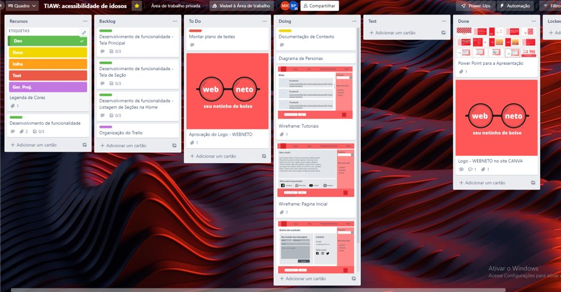

# Gerenciamento do Projeto (faltando!)

> A nossa equipe utiliza metodologias ágeis, tendo escolhido o Scrum como base para definição do processo de desenvolvimento.

## Divisão de Papéis

- Scrum Master: ...
- Product Owner: ... 
>Equipe de Desenvolvimento:
>- ... (Desenvolvedor Front End)
>- ... (Desenvolvedor Back End)
>- ... (Analista de Negócios)
>- ... (Desenvolvedor Front End)
>- ... (Designer)

## Ferramentas

Para organização e distribuição das tarefas do projeto, a equipe está utilizando o Trello estruturado com as seguintes listas: (feito!)

- Recursos: esta lista mantém template de tarefas recorrentes com as configurações padronizadas que todos devem seguir. 
- Backlog: recebe as tarefas a serem trabalhadas e representa o Product Backlog. 
- To Do:  O que precisa ser feito
- Doing: Quando uma tarefa tiver sido iniciada, ela é movida para cá (sprint 1)
- Test: Checagem de Qualidade. Quando as tarefas são concluídas, elas são movidas para o “CQ”. 
- Done: tarefas que passaram pelos testes e controle de qualidade, estando então prontas para serem entregues ao usuário. Não necessita mais edições ou revisões, ele está agendado e pronto para a ação.
- Locked: Quando alguma coisa impede a conclusão da tarefa, ela é movida para esta lista juntamente com um comentário sobre o que está travando a tarefa.

O quadro kanban do grupo no Trello está disponível através da URL https://trello.com/b/9NXUPgGY/tiaw-acessibilidade-de-idosos

> - 
