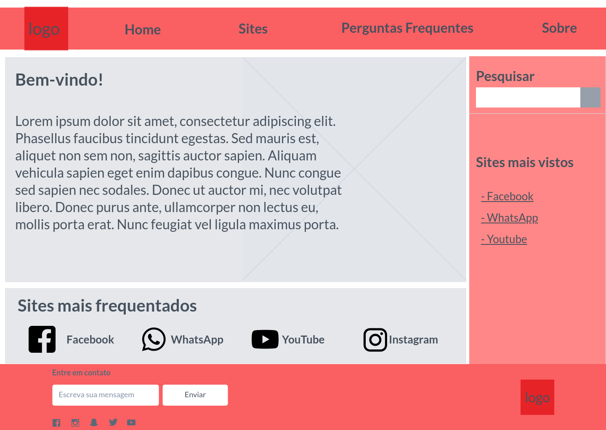
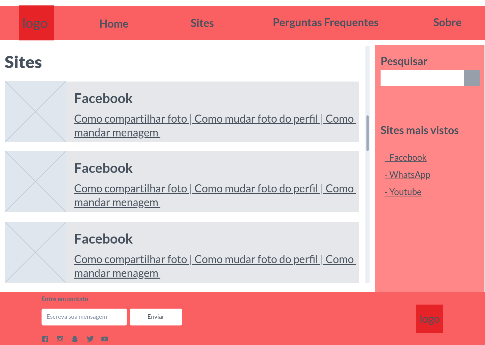
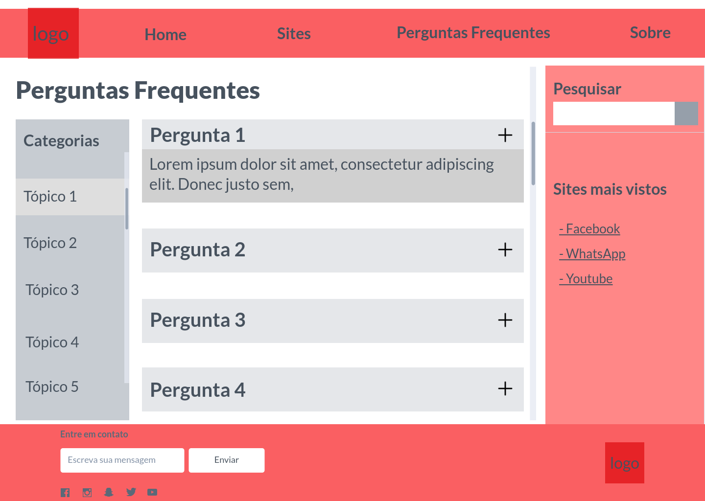
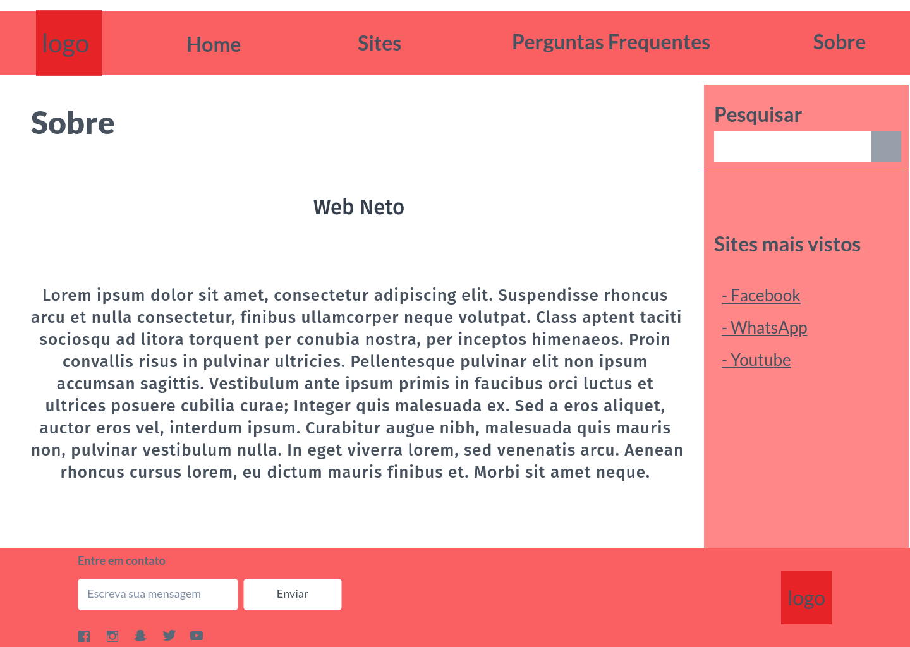
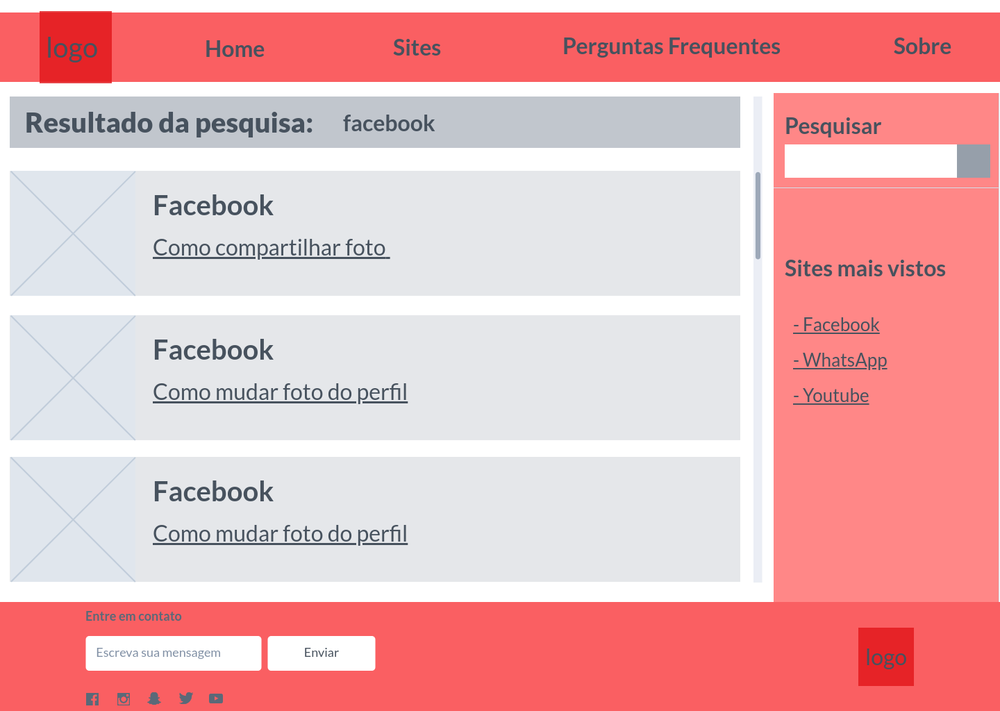
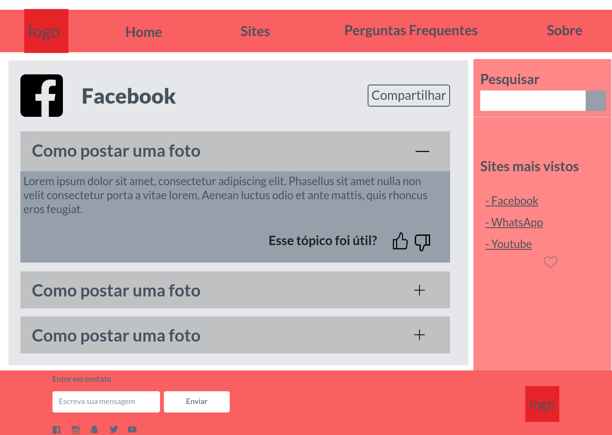
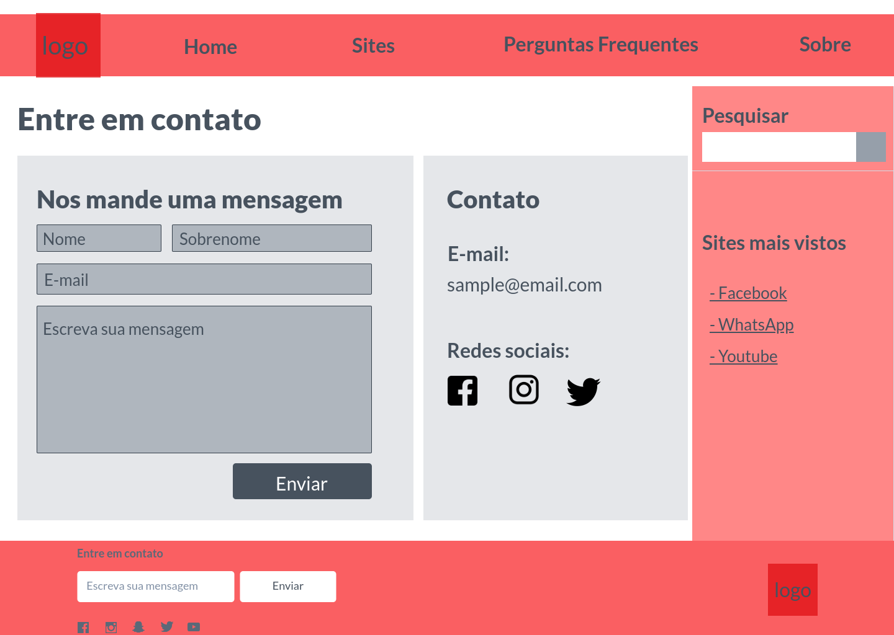

# Apresentação

## Título do Projeto
> Acessibilidade de Idosos em Plataformas Digitais

## Identidade Visual (Marca, Design) 

Tela - Home

A tela home é, como o próprio nome diz, a porta de entrada e o local das boas vindas para as experiências que podemos proporcionar para aqueles que utilizarão dos nossos serviços. Nela é possível encontrar botões que te levam para todas as outras partes do nosso projeto.

>

Tela - Sites
A tela de sites será uma lista de todos os sites que vamos oferecer suporte através do nosso projeto. Vamos oferecer também uma barra de pesquisa integrada, para que o utilizador possa fazer uma busca rápida de um site específico. 

>

Tela - Perguntas Frequentes
A tela de perguntas frequentes mostrará ao utilizador as perguntas e dúvidas mais acessadas por outros utilizadores que usaram a nossa ferramenta. 

>

Tela - Sobre
Essa página é o local que será responsável por contar ao nosso utilizador a história, objetivos e motivações que serviram para o nascimento e o desenvolvimento do nosso projeto. Também pode apresentar planos futuros.

>

Tela - Pesquisa
A tela de pesquisa será a página que mostrará para o utilizador o resultado de alguma pesquisa que ele realizou através da nossa barra de pesquisa do site, mostrando então os resultados encontrados e, caso não haja nenhum, aparecerá uma mensagem pedindo que ele busque de novo.

>

Tela - Facebook
A tela denominada facebook é, até o momento, uma página em estágios iniciais de desenvolvimento servindo de exemplo para mostrar como será a aparência e organização de uma página inicial do suporte à rede social facebook pelo nosso site. 

>

Tela - Contato
A tela de contato servirá para que o utilizador tenha amplo, fácil e rápido acesso às redes sociais do nosso projeto para poderem estar mais engajados com o projeto. A página também oferece um campo de escrita, no qual as pessoas podem usar como um canal de comunicação direta com a equipe do projeto para poderem enviar quaisquer tipos de mensagens que quiserem, sendo essas agradecimentos, dúvidas, ideias, sugestões de melhora, reclamações, reports de bugs ou problemas que enfrentaram e as experiências que tiveram, positivas ou negativas. Assim,  conseguimos procurar sempre melhorar a experiência para o nosso utilizador. 

>

Tela - Sites Mais Vistos
Essa tela é o espaço onde é possível ver quais são as páginas mais acessadas pelos usuários no nosso próprio site, facilitando então a busca dos tópicos que trazem mais dúvidas.

>

